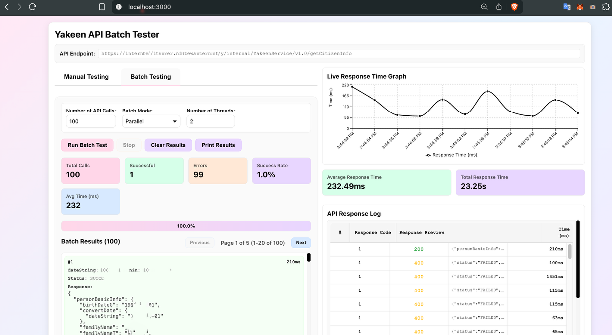

# Yakeen API Batch Tester

An application for testing the Yakeen API with batch requests, featuring a clean black and white pastel theme UI designed to fit on a single laptop screen.



## Features

### Manual Testing
- Test individual API calls with custom `dateString` and `nin` parameters
- Pre-filled default values for quick testing
- Real-time response display with detailed results

### Batch Testing
- **Sequential Mode**: Process API calls one by one in order
- **Parallel Mode**: Process multiple API calls simultaneously with configurable thread count (1-50 threads)
- Configurable number of API calls (1-10,000)
- Always includes a correct test case as the first call (from environment variables)

### Real-time Monitoring
- **Live Response Time Graph**: Visual representation of API response times over time
- **API Response Log**: Detailed table showing:
  - Serial number
  - HTTP response code (color-coded: green for 2xx, blue for 3xx, yellow for 4xx, red for 5xx)
  - Response preview (first 50 characters)
  - Response time in milliseconds
- **Statistics Tiles**:
  - Total Calls
  - Successful Calls
  - Error Count
  - Success Rate
  - Average Response Time
  - Total Response Time (displayed in seconds)

### Additional Features
- Stop button to halt ongoing batch tests
- Clear results functionality
- Print results for batch testing
- Pagination for large result sets (20 results per page)
- Real-time progress tracking
- Accurate API response time measurement (excludes proxy overhead)

## Setup

1. **Install Dependencies**
   ```bash
   npm install
   ```

2. **Configure Environment Variables**
   
   Copy `.env.example` to `.env.local`:
   ```bash
   cp .env.example .env.local
   ```
   
   Edit `.env.local` and add your values:
   ```
   BEARER_TOKEN=your_bearer_token_here
   CORRECT_TEST_DATESTRING=1444-01
   CORRECT_TEST_NIN=1063804759
   ```

3. **Run Development Server**
   ```bash
   npm run dev
   ```

4. **Build for Production**
   ```bash
   npm run build
   npm start
   ```

## API Endpoint

The application tests the following API:
```
https://internal.api.rer.nft:5543/gateway/internal/YakeenService/v1.0/getCitizenInfo
```

## Usage

### Manual Testing
1. Switch to the "Manual Testing" tab
2. Enter or modify the `dateString` and `nin` values
3. Click "Run Manual Test"
4. View results in the Manual Test Results section

### Batch Testing
1. Switch to the "Batch Testing" tab
2. Configure:
   - **Number of API Calls**: Enter the total number of API calls to make
   - **Batch Mode**: Choose between "Sequential" or "Parallel"
   - **Number of Threads**: (Only for Parallel mode) Set the number of concurrent threads
3. Click "Run Batch Test"
4. Monitor progress in real-time:
   - View statistics tiles
   - Watch the live response time graph
   - Check the API response log table
5. Use "Stop" to halt the test if needed
6. View paginated results below

## Technical Details

### Architecture
- **Frontend**: Next.js 14 with React
- **Styling**: CSS Modules with a pastel black and white theme
- **Data Visualization**: Recharts for response time graphs
- **API Proxy**: Next.js API routes to handle CORS and SSL certificate issues

### Response Time Measurement
The application measures actual API response time on the server-side proxy, excluding:
- Proxy setup overhead
- Network latency between browser and proxy
- Only measures the actual HTTPS request/response time to the API server

### Batch Modes

#### Sequential Mode
- Processes API calls one by one
- Guarantees order of execution
- Lower resource usage
- Slower overall completion time

#### Parallel Mode
- Processes multiple API calls simultaneously
- Configurable thread count (1-50)
- Faster overall completion time
- Higher resource usage
- Results may complete out of order

## Environment Variables

| Variable | Description | Required |
|----------|-------------|----------|
| `BEARER_TOKEN` | Bearer token for API authentication | Yes |
| `CORRECT_TEST_DATESTRING` | Default dateString for the first batch test call | Yes |
| `CORRECT_TEST_NIN` | Default NIN for the first batch test call | Yes |

## Project Structure

```
yakeen/
├── app/
│   ├── api/
│   │   ├── proxy/
│   │   │   └── route.ts          # API proxy route (handles CORS & SSL)
│   │   └── test-values/
│   │       └── route.ts           # Exposes test values from env
│   ├── globals.css                # Global styles
│   ├── layout.tsx                 # Root layout
│   └── page.tsx                   # Main application component
├── .env.example                   # Example environment variables
├── .env.local                     # Local environment variables (gitignored)
├── next.config.js                 # Next.js configuration
├── package.json                   # Dependencies
└── README.md                      # This file
```

## Screenshot

The application features a two-column layout:
- **Left Column**: Configuration, controls, statistics, and batch results
- **Right Column**: Live response time graph, time statistics, and API response log

The UI is designed to be compact and fit on a single laptop screen without scrolling, with a modern pastel theme using full-background tiles and outlined borders.

## License

This project is for internal use only.
